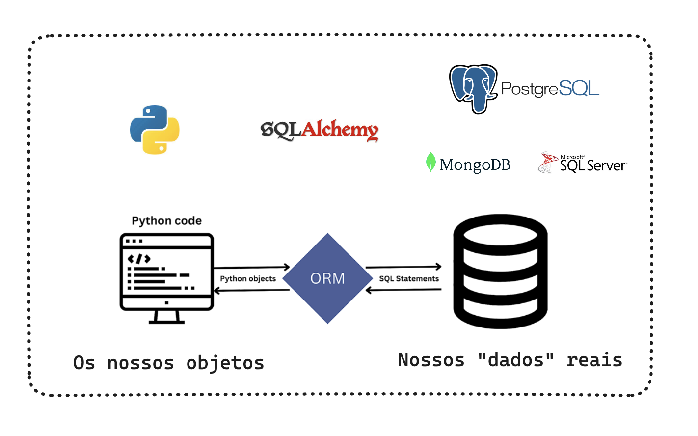

# crud-fastapi-postgres-streamlit

# CRUD FASTAPI POSTGRES STREAMLIT

Do you know what CRUD is?


The main responsible for making this possible is the ORM



## Installation via Docker

```bash
docker-compose up -d --build
```

### Usage

Frontend:
Access the address http://localhost:8501

### Documentation

Backend:
Access the address http://localhost:8000/docs

## Our folder and file structure

```bash
├── README.md # file with project documentation
├── backend # backend folder (FastAPI, SQLAlchemy, Uvicorn, Pydantic)
├── frontend # frontend folder (Streamlit, Requests, Pandas)
├── docker-compose.yml # docker-compose configuration file (backend, frontend, postgres)
├── poetry.lock # poetry lock file
└── pyproject.toml # poetry configuration file
```

## Our Backend

Our backend will be an API, which will be responsible for communicating between our frontend and the database. Let's detail each of the folders and files in our backend.

### FastAPI

FastAPI is a web framework for building APIs with Python. It is based on Starlette, which is an asynchronous framework for building APIs. FastAPI is a framework that is growing a lot, and has a very low learning curve, as it is very similar to Flask.

### Uvicorn

Uvicorn is an asynchronous web server, which is based on ASGI, which is a specification for asynchronous web servers. Uvicorn is the web server recommended by FastAPI, and it is the server we will use in this project.

### SQLAlchemy

SQLAlchemy is a library for communicating with the database. It is an ORM (Object Relational Mapper), which is an object-relational mapping technique that allows you to communicate with the database using objects.

One of the main advantages of working with SQLAlchemy is that it is compatible with various databases, such as MySQL, PostgreSQL, SQLite, Oracle, Microsoft SQL Server, Firebird, Sybase and even Microsoft Access.

Furthermore, it performs data sanitization, preventing SQL Injection attacks.

Another point is that you can work with native Python methods, such as filter, which is widely used to create filters in lists. This makes our lives a lot easier, as we don't need to learn a new language to communicate with the database. Anyone familiar with Pandas will feel at home.

### Pydantic

Pydantic is a library for performing data validation. It is used by FastAPI to validate the data that is received by the API, and also to define the types of data that are returned by the API.

## Our folder and file structure

```bash
├── backend
│ ├── Dockerfile        # Docker configuration file
│ ├── crud.py           # File with CRUD functions using SQL Alchemy ORM
│ ├── database.py       # File with database configuration using SQL Alchemy 
│ ├── main.py           # Responsible for defining the application of FastAPI
│ ├── models.py         # Responsible for defining SQLAlchemy models
│ ├── requirements.txt  # 
│ ├── router.py         # Responsible for defining API routes using FastAPI
│ └── schemas.py        # Responsible for defining Pydantic schemas
```

## `schemas.py` file

The `schemas.py` file is responsible for defining Pydantic's schemas, which are the classes that define the data types that will be used in the API. These schemas are used to validate the data received by the API, and also to define the types of data that are returned by the API.

Pydantic is the main library for data validation in Python. It is used by FastAPI to validate the data received by the API, and also to define the types of data that are returned by the API.

Furthermore, it has very good integration with SQLAlchemy, which is the library we use to communicate with the database.

Another advantage is its pre-defined types, which make our lives a lot easier. For example, if you want to define a field that only accepts positive numbers, you can use PositiveInt. If you want to define a field that only accepts certain categories, you can use the constrains constructor.

Please note that we created different schemas for the returns from our API. This is good practice as it allows you more flexibility to change schemas in the future.

We have the `ProductBase` schema, which is the base schema for product registration. This schema is used to validate the data that is received by the API, and also to define the types of data that are returned by the API.

We have the `ProductCreate` schema, which is the schema that is returned by the API. It is a class that inherits from the `ProductBase` schema, and has an additional field, which is the id. This field is used to identify the product in the database.

We have the `ProductResponse` schema, which is the schema that is returned by the API. It is a class that inherits from the `ProductBase` schema, and has two more fields, which are id and created_at. These fields are generated by our database.

We have the `ProductUpdate` schema, which is the schema that is received by the API for update. It has optional fields, as it is not necessary to send all the fields to update.

## `database.py` file

The `database.py` file is responsible for configuring the database using SQLAlchemy. It is responsible for creating the connection to the database, and also for creating the database session.

If you want to change databases, you just need to change the connection URL, which is in the SQLALCHEMY_DATABASE_URL variable. SQLAlchemy is compatible with various databases such as MySQL, PostgreSQL, SQLite, Oracle, Microsoft SQL Server, Firebird, Sybase and even Microsoft Access.

The main points of this file are the engine, which is the connection to the database, and the SessionLocal, which is the database session. The SessionLocal is the one that executes the queries in the database.


## `models.py` file

The `models.py` file is responsible for defining the SQLAlchemy models, which are the classes that define the database tables. These models are used to communicate with the database.

This is where we define the table name, fields and data types. We were able to include randomly generated fields, such as id and created_at. For the id, when including the Integer field, with the primary_key=True parameter, SQLAlchemy already understands that this field is the table's id. For created_at, when including the DateTime field, with the default=datetime parameter, SQLAlchemy already understands that this field is the table's creation date.

## File `crud.py`

The `crud.py` file is responsible for defining the CRUD functions using the SQLAlchemy ORM. These functions are used to communicate with the database. This is where we define the functions of listing, creating, updating and removing products. This is where the data is persisted in the database.

## `router.py` file

The `router.py` file is responsible for defining API routes using FastAPI. This is where we define the routes, and also the functions that will be performed on each route. All functions defined here receive one parameter, which is the request parameter, which is the object that contains the request data.

The main parameters are path, which is the path of the route, methods, which are the HTTP methods that the route accepts, and response_model, which is the schema that is returned by the route.

```python
@router.post("/products/", response_model=ProductResponse)
```
It is important to highlight that FastAPI uses the concept of type hints, which are type annotations. This allows FastAPI to validate the data that is received into the API, and also to define the types of data that are returned by the API. For example, when defining the product parameter of type ProductResponse, FastAPI already understands that the data received in this parameter must be of type ProductResponse.

We can also return parameters through our path, in the case of delete, for example, we need to pass the id of the product we want to delete. To do this, we use the path /products/{product_id}, and define the product_id parameter in the delete_product function.

```python
@router.get("/products/{product_id}", response_model=ProductResponse)
def read_product_route(product_id: int, db: Session = Depends(get_db)):
    db_product = get_product(db, product_id=product_id)
    if db_product is None:
        raise HTTPException(status_code=404, detail="Product not found")
    return db_product
```

## `main.py` file

The `main.py` file is responsible for defining the FastAPI application, and also for defining the Uvicorn web server. This is where we define the web server, and also the web server settings such as the host and port.


## Our Frontend

Our frontend will be an application that will consume our API, and will be responsible for registering, changing and removing products. Let's detail each of the folders and files in our frontend.

### Streamlit

Streamlit is a library for building web applications with Python. It is widely used to build dashboards, and also to build applications that consume APIs.

### Requests

Requests is a library for making HTTP requests with Python. It is widely used to consume APIs, and also for web scraping.

### Pandas

Pandas is a library for manipulating data with Python. It is widely used to perform data analysis, and also to build dashboards.

